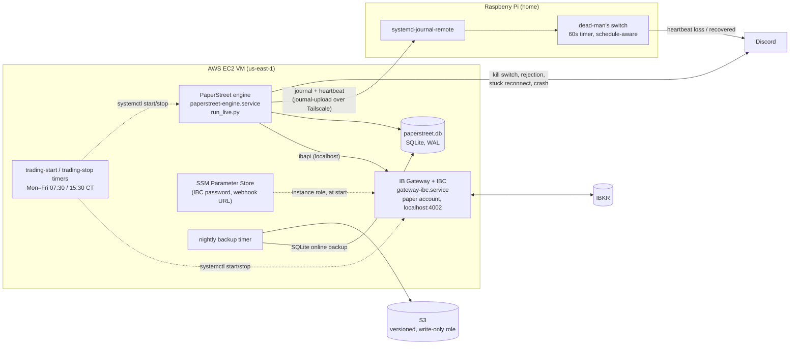

# PaperStreet

A systematic trading system for US equities and futures, built on the Interactive Brokers API. It targets medium-frequency strategies (hold times from minutes to weeks). It has an event-driven backtesting engine, a staged research pipeline built to kill bad hypotheses cheaply, and an unattended production deployment.

I run market operations at a derivatives exchange by day. This is the participant side of that same world, built for the love of the operational architecture. V1 was Java (2022); V2 is a ground-up Python rewrite (2026).

## Status: paper trading only

**No strategy trades real money, and none is planned right now.** Every research candidate so far has been rejected on its own evidence (see below). The production host runs a `buy_and_hold` benchmark on an IBKR **paper** account. Its job is to prove the engine and infrastructure in real market hours: connection recovery, broker-as-source-of-truth resync, reconciliation, alerting, and the daily start/stop. It is not there to make money. Going live would be a separate decision, made only once a strategy clears its out-of-sample gate.

This is a curated public mirror of a private working repo. Broker account identifiers, pre-live risk-limit values, host addresses, and cloud resource names are redacted or replaced with placeholders. Anything not yet killed or shipped stays private. What's here is the architecture, the deployment, the backtesting and research methodology, and a set of documented strategy rejections.

---

## Start here: `research/killed/`

Most of the research this system has produced ended in a documented rejection, not a deployed strategy. That's by design. Each subdirectory under `research/killed/` is a candidate that went through the staged research workflow (see `research/killed/research_notes/`) and stopped there, with the code, diagnostics, and reasoning preserved:

- **`spy_short_reversal`**: Connors RSI(2) mean-reversion overlay on SPY. Passed in-sample and a plateau check, but parked at the out-of-sample gate. It didn't beat a plain 200-day timing benchmark or buy-and-hold, net of realized cash rates.
- **`overnight_drift`**: close-to-open SPY drift. Gross Sharpe beat buy-and-hold; net of round-trip costs, it didn't. The failure is a structural cost asymmetry, not decay.
- **`intraday_conditional`**: conditional intraday continuation/reversion on QQQ. Rejected at the in-sample EDA stage. The cross-tabs were non-monotonic, no bucket cleared a basic significance bar, and the effect's sign inverted across window lengths.
- **`diversified_trend`**: time-series momentum across a diversified CME futures basket. Killed on a drought-regime robustness check. Nearly the whole lifetime Sharpe came from one five-year window, and the remaining subperiod was flat with a deep drawdown.
- **`basket_statarb`**: cointegrated-basket mean reversion (Johansen/Box-Tiao weights, OU half-life screens). The discovery and validation tooling is built and tested. No candidate basket has cleared the half-life and weight-stability gates.
- **`petroleum_status_drift`**: event drift in crude futures after surprises in the weekly EIA inventory report. Parked before the hypothesis was ever tested, because the data-depth gate failed. Most of IBKR's nominal CL history on this account turned out to be placeholder bars (`open==high==low==close`, zero volume). That left 101 usable events against a pre-committed floor of 200. The EIA event data and the depth-probe tooling are reusable.

Every candidate declares its kill criteria and capital track *before* looking at out-of-sample data (see `research/killed/research_notes/RESEARCH_WORKFLOW_regime_template.md` for the template). The one-shot OOS test is honored, with no re-tuning after a miss.

---

## Architecture

- **`ib_app.py`**: the core `IBApp` class, a combined `EWrapper`/`EClient` that is the single interface to IB Gateway. Market data, order events, and account state all flow through its callbacks.
- **`backtesting/`**: a custom event-loop engine (`engine.py`), not a vectorized library. Strategies are inventory-aware and path-dependent (signals depend on realized fills), which vectorized backtesters model poorly. Fills happen at the next bar's open (`SimBroker` in `broker.py`) to stay lookahead-safe. `portfolio.py` handles long/short accounting, and `metrics.py` computes Sharpe, drawdown, and win rate.
- **`strategy/`**: the strategy interface (`base_strategy.py::BaseStrategy`), a typed `OrderRequest` signal (`signal.py`), and a name-based registry (`registry.py`), so strategies are selected by config, not import. Strategies emit signals only; they never place orders.
- **`risk/`**: a pre-trade `RiskGate` built from independently unit-tested rules (kill switch, connection-liveness/stale-data guard, a latching daily loss limit, per-order size caps) that runs before any order reaches the broker. Also includes a daily position reconciliation (`reconciliation.py`) that checks IBKR's reported position against the system's own recorded fills and trips the kill switch on any divergence.
- **`run_live.py`**: the live loop. It reconciles open orders with IBKR at startup (so a restart can't double an in-flight order), reconnects with backoff when the connection drops, emits a heartbeat line every iteration, and runs the daily reconciliation.
- **`alerts/`**: Discord alerts from four choke points: kill-switch trip, hard order rejection, a reconnect that won't recover, and an unhandled trading-loop exception.
- **`database/`**, **`market_data/`**, **`orders/`**, **`contracts/`**: the supporting persistence and IBKR-interaction layers described in `docs/ARCHITECTURE.md` and `docs/DATA_MODEL.md`.

---

## Production deployment

The engine runs unattended on a small AWS VM, supervised by systemd, with monitoring on a separate box so that a dead process can't take its own death notice with it.



- **Broker is the source of truth.** On every start and reconnect, positions and open orders are rebuilt from IBKR, never from local state. Local state is only a cross-check (the daily reconciliation).
- **Market-hours only.** systemd timers start Gateway and the engine at 07:30 and stop them at 15:30 America/Chicago, so nothing is connected through IBKR's nightly reset.
- **Host config is version-controlled** under `deploy/` (IBC `config.ini`, every systemd unit, journald drop-ins, the dead-man's switch). It is installed by copy, never symlink, and a daily drift check alerts when a host diverges from the repo. `.github/workflows/systemd-verify.yml` runs `systemd-analyze verify` on every unit file in CI.
- **Backups:** a nightly SQLite online backup of the live DB goes to a versioned S3 bucket (`scripts/backup_live_db.sh`), plus daily EBS snapshots.

Design and rationale: `docs/DEPLOYMENT.md`. What broke while building it and what each failure changed: `docs/DEPLOYMENT_INCIDENTS.md`. The account/service inventory: `docs/OPERATIONS.md`.

---

## Docs

- `ARCHITECTURE.md`: system design, threading model, data flow
- `BACKTESTING.md`: fill assumptions, lookahead-bias rules, benchmark attribution
- `DATA_MODEL.md`: schema and in-memory state
- `IBKR_NOTES.md`: API quirks, rate limits, error codes
- `STRATEGY.md`: the strategy interface contract and the instrument-universe constraint
- `UNIVERSE.md`: the tiered list of admissible instruments
- `RISK.md`: risk controls and known gaps (pre-live parameter values are redacted in this mirror)
- `DEPLOYMENT.md`, `DEPLOYMENT_INCIDENTS.md`, `OPERATIONS.md`: production deployment
- `ROADMAP.md`: what's built, what's next, and what was decided against
- `MULTI_STRATEGY_REFACTOR.md`: the multi-symbol strategy refactor (Phases 1–2 shipped, 3–5 parked)

---

## Tests

`tests/` covers the backtesting engine, the strategy contract, the risk gate and reconciliation, IBApp callbacks (against a mocked `EClient`, no live Gateway needed), the live loop's reconnect and order-reconciliation paths, Discord alerting, the database layer, and the killed `spy_short_reversal` / `basket_statarb` candidates.

```bash
pip install -r requirements.txt -r requirements-research.txt   # plus ibapi 10.x from IBKR's TWS API download
pytest
```
